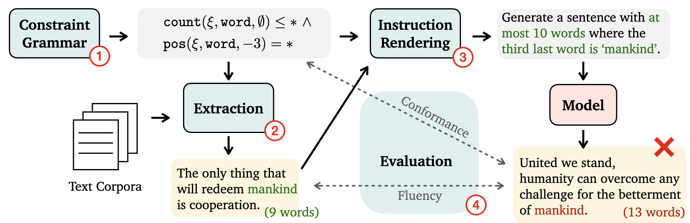

# COLLIE: Systematic Construction of Constrained Text Generation Tasks ([Website](https://collie-benchmark.github.io/))



We propose the COLLIE framework for easy constraint structure specification, example extraction, instruction rendering, and model evaluation. Paper: https://arxiv.org/abs/2307.08689.


## Install
We recommand using Python 3.9 (3.10 as of now might have incompatabilty of certain dependencies). 

* Install from PyPI: `pip install collie-bench`

* Install from repo in development mode: `pip install -e .`

After installation you can access the functionalities through `import collie`.

## Overview

There are two main ways to use COLLIE:
1. Use the [COLLIE-v1 dataset](#collie-v1-dataset) to run your methods and compare to the ones reported in the paper
2. Use the [COLLIE framework](#collie-framework-for-dataset-construction) to construct new/customed/harder constraints


## COLLIE-v1 Dataset

The dataset used in the paper is at `data/all_data.dill` and can be loaded by 
```python
with open("data/all_data.dill", "rb") as f:
    all_data = dill.load(f)
```

`all_data` will be a dictionary with keys as the data source and constraint type, and values as a list of constraints. For example, `all_data['wiki_c07'][0]` is

```python
{
    'example': 'Black market prices for weapons and ammunition in the Palestinian Authority-controlled areas have been rising, necessitating outside funding for the operation.', 
    'targets': ['have', 'rising', 'the'], 
    'constraint': ..., 
    'prompt': "Please generate a sentence containing the word 'have', 'rising', 'the'.", 
    ...
}
```

Reproducing the results reported in the paper:
- Our model results can be found in `logs/` folder
- To plot the figures/tables in the paper, check out `scripts/analysis.ipynb`
- To run the models to reproduce the results, run `python scripts/run_api_models.py` and `python scripts/run_gpu_models.py`


## COLLIE Framework for Dataset Construction

The framework follows a 4-step process:
1. [Constraint Specification](#step-1-constraint-specification-complete-guide)
2. [Extraction](#step-2-extraction-complete-guide)
3. [Rendering](#step-3-rendering)
4. [Evaluation](#step-4-evaluation)


### Step 1: Constraint Specification ([Complete Guide](docs/constraint_spec.md))

To specify a constraint, you need the following concepts defined as classes in `collie/constraints.py`:
1. `Level`: deriving classes `InputLevel` (the basic unit of the input) and `TargetLevel` (the level for comparing to the target value); levels include `'character'`, `'word'`, `'sentence'`, etc
2. `Transformation`: defines how the input text is modified into values comparable against the provided target value; it derives classes like `Count`, `Position`, `ForEach`, etc
3. `Logic`: `And`, `Or`, `All` that can be used to combine constraints
4. `Relation`: relation such as `'=='` or `'in'` for compariing against the target value
5. `Reduction`: when the target has multiple values, you need to specify how the transformed values from the input is reduced such as `'all'`, `'any'`, `'at least'`
6. `Constraint`: the main class for combining all the above specifications

To specify a constraint, you need to provide at least the `TargetLevel`, `Transformation`, and `Relation`.
They are going to be wrapped in the `c = Constraint(...)` initialization. Once the constraint is specified, you can use `c.check(input_text, target_value)` to verify any given text and target tuple.

Below is an example of specifying a "counting the number of word constraint".
```python
>>> from collie.constraints import Constraint, TargetLevel, Count, Relation

# A very simple "number of word" constraint.
>>> c = Constraint(
>>>     target_level=TargetLevel('word'),
>>>     transformation=Count(), 
>>>     relation=Relation('=='),
>>> )
>>> print(c)
Constraint(
    InputLevel(None),
    TargetLevel(word),
    Transformation('Count()'),
    Relation(==),
    Reduction(None)
)
```
Check out the [guide](docs/constraint_spec.md) to explore more examples.


### Step 2: Extraction ([Complete Guide](./docs/extraction.md))
Once the constraints are defined, you can now extract examples from the datasources (e.g., Gutenberg, Wikipedia) that satisfy the specified constraints.

To download necessary data files including the `Gutenberg, dammit` corpus to the `data` folder, run from the root project dir:
```
bash download.sh
```

Run extraction:
```
python -m collie.examples.extract
```
This will sweep over all constraints and data sources defined in `collie/examples/`. To add additional examples, you can add them to the appropriate python files.
Extracted examples can be found in the folder `sample_data`. The files are named as: `{source}_{level}.dill`. The `data/all_data.dill` file is simply a concatenation of all these source-level dill files.

### Step 3: Rendering

To render a constraint, simply run: 
```python
>>> from collie.constraint_renderer import ConstraintRenderer
>>> renderer = ConstraintRenderer(
>>>     constraint=c,  # Defined in step one
>>>     constraint_value=5
>>> )
>>> print(renderer.prompt)
Please generate a sentence with exactly 5 words.
```

### Step 4: Evaluation

To check constraint satisfication, simply run:
```python
>>> text = 'This is a good sentence.'
>>> print(c.check(text, 5))
True
>>> print(c.check(text, 4))
False
```
## Citation
Please cite our paper if you use COLLIE in your work:

```bibtex
@misc{yao2023collie,
      title={{COLLIE}: Systematic Construction of Constrained Text Generation Tasks}, 
      author={Shunyu Yao and Howard Chen and Austin W. Hanjie and Runzhe Yang and Karthik Narasimhan},
      year={2023},
      eprint={2307.08689},
      archivePrefix={arXiv},
      primaryClass={cs.CL}
}
```

## License
MIT. Note that this is the license for our code, but each data source retains their own respective licenses. 
